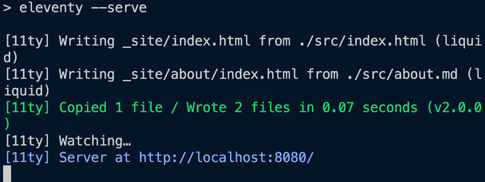

### ⚙ Scripts principales

* `dev` → Ejecuta 11ty en **modo serve**

  * Levanta servidor local
  * Incluye **live reloading**
  * Ideal para desarrollo

* `build` → Genera el sitio estático

  * No levanta servidor
  * Produce archivos listos para subir a CDN o servidor

Ambos comandos son suficientes para este proyecto.

---

### ▶ Ejecutar build

```bash
npm run build
```



**Resultado:**

* Se crea la carpeta `_site`
* Contiene el HTML generado
* `about.xhtml` → se convierte en `/about/index.xhtml`
  (URL más limpia)
* `index.xhtml` queda en la raíz de `_site`
* El contenido generado es idéntico al original

---

### 🌐 Servidor local

* URL por defecto: `http://localhost:8080`
* La navegación funciona
* El CSS aún no se carga (requiere configuración)

---

### 🧩 Punto clave

11ty funciona sin configuración,
pero agregar configuración:

* Mejora la organización
* Permite procesar assets (CSS, imágenes)
* Habilita funcionalidades adicionales

---

Si quieres, el próximo bloque puedo dejarlo también en formato “Ultra Compacto” listo para tus apuntes.
