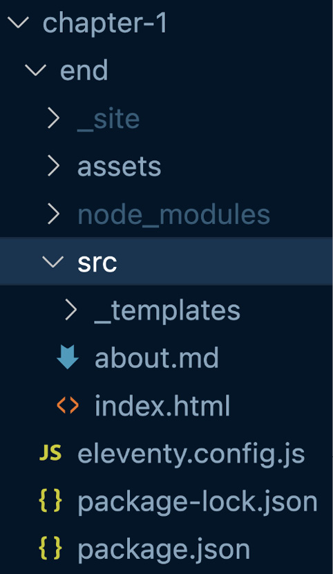

## 11ty — Estructura `src` y Sistema de Templates

## 11ty — `src`, Templates y Layouts (Resumen Ultra Compacto, fiel al texto)

---

### 📁 Mover archivos a `src`

1. Crear carpeta `src/`.
2. Mover `index.xhtml` y `about.xhtml` dentro de `src/`.
3. El sitio dejará de funcionar temporalmente (esperado).

---

### ⚙ Configurar directorio de entrada

Actualizar `eleventy.config.js` para indicar que 11ty use `src` como origen:

```js
module.exports = function(eleventyConfig) {

    // Copiar assets al build
    eleventyConfig.addPassthroughCopy("assets");

    return {
        dir: {
            input: "src",
            output: "_site" // Es el valor por defecto
        }
    }
}
```

📌 Resultado:

* 11ty ya no usa la raíz como input.
* Usa `src/` como directorio fuente.
* `_site/` sigue siendo el directorio de salida.

Después de guardar, el sitio vuelve a compilar correctamente.

---

## 🧱 Estructura resultante

```
project-root/
│
├─ eleventy.config.js
├─ assets/
├─ src/
│   ├─ index.xhtml
│   ├─ about.xhtml
│
└─ _site/  → HTML generado
```

Durante el resto del libro:

* Pages, templates y data residirán dentro de `src/`.

---

## 🧠 Terminología en 11ty

11ty soporta múltiples motores de plantillas (Liquid, Nunjucks, Handlebars, etc.), lo que puede generar confusión.

Definiciones utilizadas en el libro:

* **Page** → Archivo que genera una URL final
  Ej: `index.xhtml`, `about.xhtml`

* **Layout** → Archivo que envuelve el contenido de una página con la estructura HTML completa

* **Include** → Fragmento pequeño y reutilizable compartido por múltiples páginas o layouts

* **Template** → Includes o layouts

---

## 📁 Crear carpeta de templates personalizada

1. Dentro de `src/`, crear:

   ```
   src/_templates/
   ```

Por defecto, 11ty usa `_includes/`.
Aquí se cambia por claridad semántica.

---




### ⚙ Configurar carpeta `_templates`

Actualizar el objeto `dir`:

```js
module.exports = function(eleventyConfig) {

    eleventyConfig.addPassthroughCopy("assets");

    return {
        dir: {
            input: "src",
            output: "_site",
            includes: "_templates"
        }
    }
}
```

📌 Resultado:

* 11ty buscará layouts e includes en `src/_templates/`.
* No se usa `_includes/`.
* Se mantiene una estructura más clara según el enfoque del libro.

---

Si quieres, ahora seguimos con la creación del primer layout base, manteniendo el mismo nivel de fidelidad.
